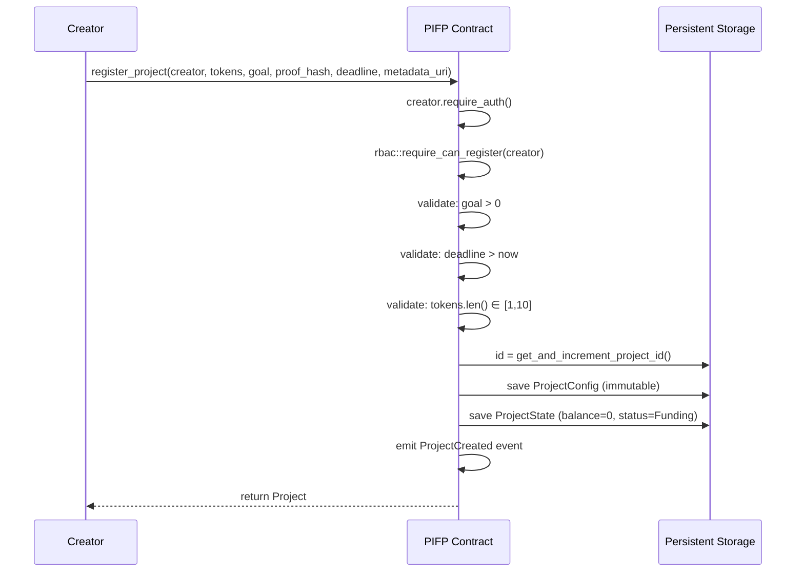
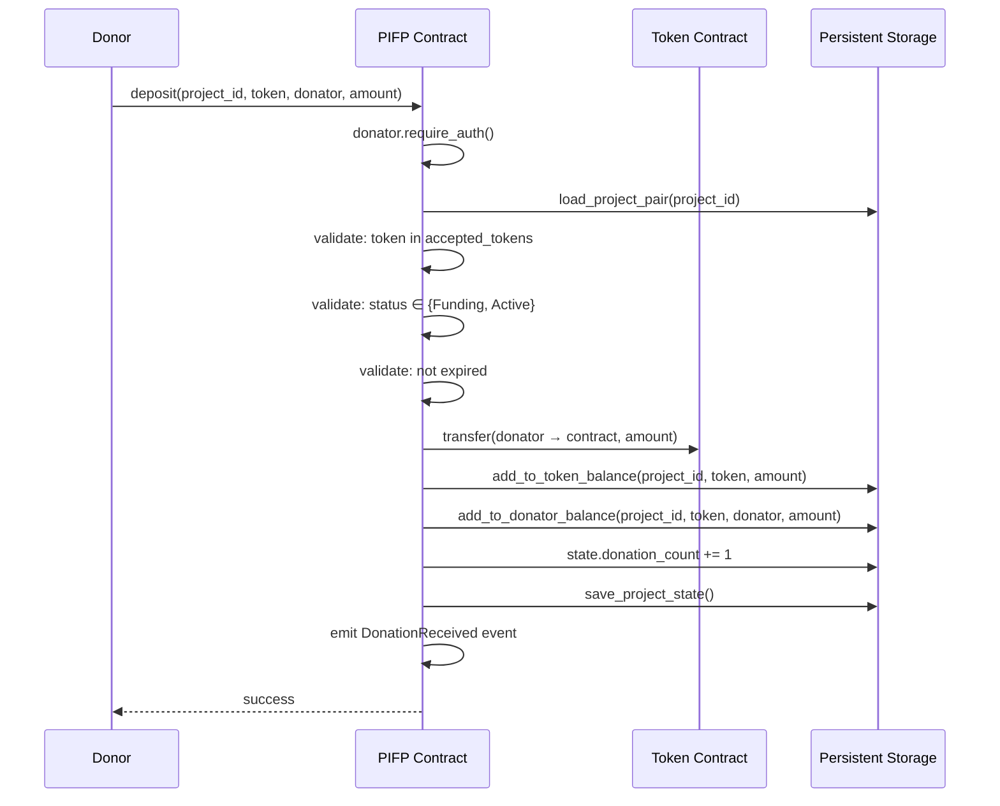
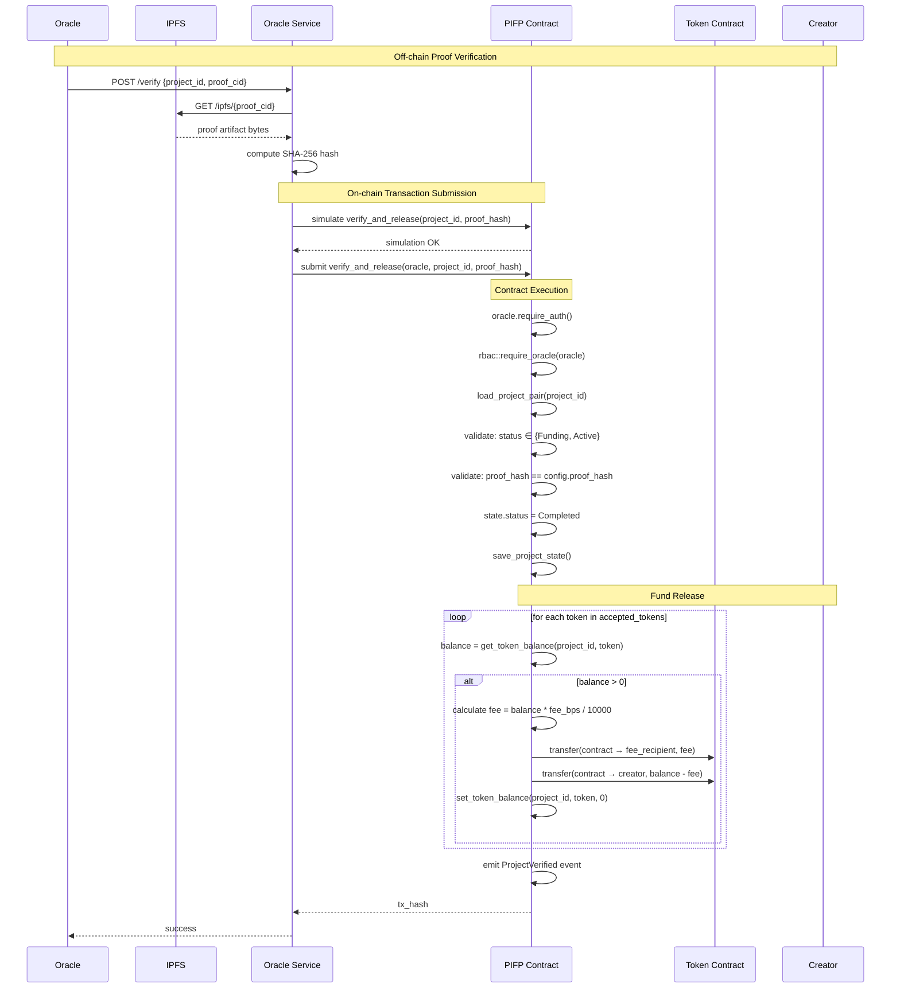
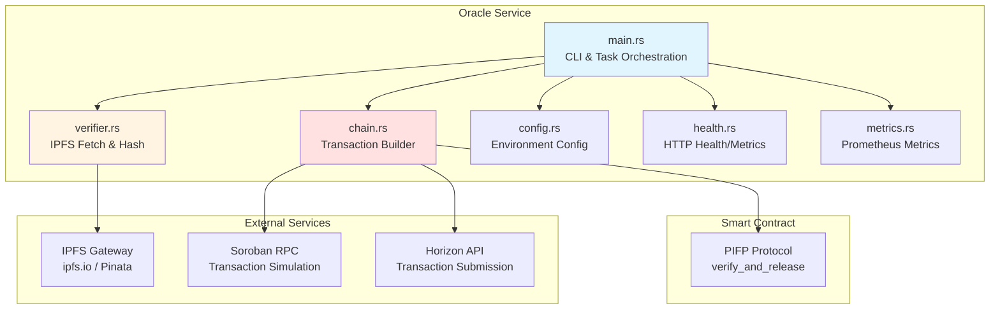
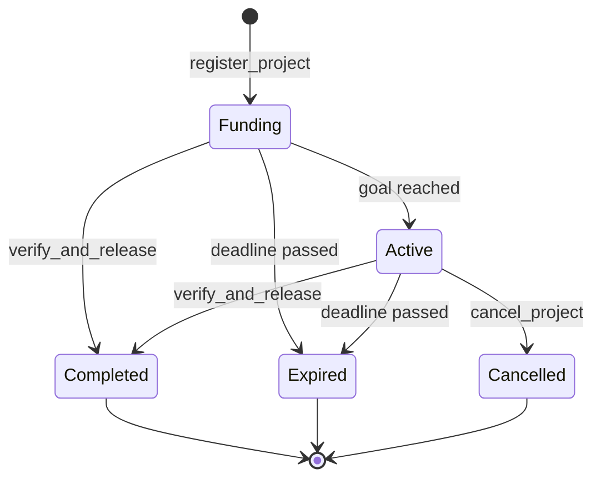

# PIFP Protocol — System Architecture & Threat Model

> **Proof-of-Impact Funding Protocol (PIFP)** — Trust-minimized conditional funding on Stellar/Soroban.

---

## Table of Contents

1. [System Overview](#1-system-overview)
2. [Component Architecture](#2-component-architecture)
3. [Data Model](#3-data-model)
4. [Access Control (RBAC)](#4-access-control-rbac)
5. [Core Flows](#5-core-flows)
6. [Storage Design](#6-storage-design)
7. [Oracle Service Architecture](#7-oracle-service-architecture)
8. [Data Dictionary](#8-data-dictionary)
9. [Error Catalogue](#9-error-catalogue)
10. [Threat Model](#10-threat-model)
11. [Security Properties](#11-security-properties)
12. [Known Limitations & Future Work](#12-known-limitations--future-work)
13. [Deployment Checklist](#13-deployment-checklist)

---

## 1. System Overview

PIFP replaces trust-based donations with **cryptographic accountability**. Funds are locked inside a Soroban smart contract and can only be released when a designated Oracle submits a proof hash that matches the one registered at project creation.

> *For detailed function signatures, parameters, and CLI examples, please see the [Smart Contract API Reference](./docs/contract_api.md).*

```
┌──────────────┐     register_project     ┌─────────────────────────┐
│ ProjectManager│ ───────────────────────► │                         │
└──────────────┘                           │    PifpProtocol         │
                                           │    (Soroban Contract)   │
┌──────────────┐     deposit               │                         │
│   Donor      │ ───────────────────────► │  • RBAC                 │
└──────────────┘                           │  • Project Registry     │
                                           │  • Proof Verification   │
┌──────────────┐     verify_and_release    │  • Fund Release         │
│   Oracle     │ ───────────────────────► │                         │
└──────────────┘                           └─────────────────────────┘
                                                       │
                                           ┌───────────▼──────────────┐
                                           │  Stellar Token Contract  │
                                           │  (SAC / custom asset)    │
                                           └──────────────────────────┘
```

**Key properties:**

- Non-custodial — funds live in the contract, never in a third-party wallet.
- Permissioned writes — only addresses with the correct RBAC role may mutate state.
- Immutable project config — goal, token, deadline, and proof hash are set once and never changed.
- Event-driven audit trail — every role change and fund movement emits an on-chain event.

---

## 2. Component Architecture

```
contracts/pifp_protocol/src/
├── lib.rs        — Public entry points (contract interface)
├── errors.rs     — Error catalogue (#[contracterror] enum with documented variants)
├── rbac.rs       — Role-Based Access Control
├── storage.rs    — Persistent & instance storage helpers + TTL management
├── types.rs      — Shared data types (Project, ProjectConfig, ProjectState, Role)
├── events.rs     — On-chain event emission helpers
├── invariants.rs — Invariant assertions used in tests
├── test.rs       — Unit & integration tests
├── test_errors.rs — Comprehensive error-path tests
└── fuzz_test.rs  — Property-based fuzz tests (proptest)
```

> *For detailed function signatures, parameters, and CLI examples for `lib.rs`, please see the [Smart Contract API Reference](./docs/contract_api.md).*

### `lib.rs` — Contract Interface

The single entry point file. Every public `fn` here is a Soroban contract method callable by transactions. Responsibilities:

- Delegates RBAC checks to `rbac.rs` before any mutation.
- Delegates storage reads/writes to `storage.rs`.
- Emits events for off-chain indexers.

### `rbac.rs` — Role-Based Access Control

Manages the role hierarchy and enforces authorization. All role data is stored in **persistent storage** under `RbacKey::Role(address)`.

### `storage.rs` — Storage Abstraction

Abstracts all `env.storage()` calls behind typed helpers. Manages TTL bumping to prevent ledger entry expiry.

### `types.rs` — Data Types

Defines `ProjectConfig` (immutable, written once) and `ProjectState` (mutable, updated on deposits/verification). The split reduces write costs on high-frequency operations.

---

## 3. Data Model

### ProjectConfig (Immutable — written once at registration)

| Field        | Type          | Description                              |
|--------------|---------------|------------------------------------------|
| `id`         | `u64`         | Auto-incremented unique identifier       |
| `creator`    | `Address`     | Address that registered the project      |
| `token`      | `Address`     | Stellar token contract address           |
| `goal`       | `i128`        | Target funding amount (must be > 0)      |
| `proof_hash` | `BytesN<32>`  | Expected proof artifact hash (e.g. IPFS CID digest) |
| `deadline`   | `u64`         | Ledger timestamp by which work must complete |

### ProjectState (Mutable — updated on deposits and verification)

| Field     | Type            | Description                        |
|-----------|-----------------|------------------------------------|
| `balance` | `i128`          | Current funded amount (never < 0)  |
| `status`  | `ProjectStatus` | Lifecycle state (see below)        |

### ProjectStatus — Lifecycle FSM

```
  [Funding] ──deposit──► [Funding]   (balance increases, status unchanged)
      │
      ├──verify_and_release──► [Completed]  (proof matches, funds releasable)
      │
      └──deadline passed ──► [Expired]     (triggered via `expire_project` entry point)

  [Active] ──verify_and_release──► [Completed]
  [Completed] ──(any)──► PANIC (MilestoneAlreadyReleased)
  [Expired]   ──(any)──► PANIC (ProjectNotFound)
```

Valid forward transitions only — status can never regress.

---

## 4. Access Control (RBAC)

### Role Hierarchy

```
SuperAdmin
    │
    ├── Admin          — manage roles, configure protocol parameters
    ├── Oracle         — call verify_and_release; trigger fund releases
    ├── Auditor        — read-only observer (off-chain checks, no on-chain gate)
    └── ProjectManager — register and manage own projects
```

### Role Assignment Rules

| Caller Role | Can Grant           | Cannot Grant  |
|-------------|---------------------|---------------|
| SuperAdmin  | Any role            | —             |
| Admin       | Admin, Oracle, Auditor, ProjectManager | SuperAdmin |
| Others      | —                   | Anything      |

### Invariants

1. **Single SuperAdmin** — stored separately at `RbacKey::SuperAdmin`. Can only be changed via `transfer_super_admin`.
2. **No self-demotion** — `revoke_role` cannot be called on the SuperAdmin address; use `transfer_super_admin`.
3. **One role per address** — granting a new role to an address that already holds one replaces it.
4. **Immutable init** — `init` can be called exactly once; subsequent calls panic with `AlreadyInitialized`.

### Entry Point Authorization Matrix

| Entry Point            | Allowed Roles                              |
|------------------------|---------------------------------------------|
| `init`                 | Any (first caller becomes SuperAdmin)        |
| `grant_role`           | SuperAdmin, Admin (SuperAdmin only for SuperAdmin grant) |
| `revoke_role`          | SuperAdmin, Admin                            |
| `transfer_super_admin` | SuperAdmin only                              |
| `register_project`     | SuperAdmin, Admin, ProjectManager            |
| `set_oracle`           | SuperAdmin, Admin                            |
| `verify_and_release`   | Oracle only (read from storage)              |
| `deposit`              | Any address (no RBAC gate)                   |
| `expire_project`      | Any address (no RBAC gate)                   |
| `get_project`          | Any address (read-only)                      |
| `role_of` / `has_role` | Any address (read-only)                      |

---

## 5. Core Flows

### 5.1 Project Registration



### 5.2 Deposit



### 5.3 Oracle Verification & Fund Release



---

## 6. Storage Design

PIFP uses two Soroban storage tiers with optimized TTL management:

### Instance Storage (contract-lifetime TTL)

| Key               | Type             | Description                         |
|-------------------|------------------|-------------------------------------|
| `ProjectCount`    | `u64`            | Global auto-increment project ID counter |
| `IsPaused`        | `bool`           | Protocol pause state                |
| `ProtocolConfig`  | `ProtocolConfig` | Global protocol configuration (fee_recipient, fee_bps) |

TTL: bumped by **7 days** whenever below 1 day remaining.

### Persistent Storage (per-entry TTL)

| Key                                    | Type            | Description                                  |
|----------------------------------------|-----------------|----------------------------------------------|
| `ProjConfig(id)`                       | `ProjectConfig` | Immutable project configuration              |
| `ProjState(id)`                        | `ProjectState`  | Mutable project state                        |
| `TokenBalance(project_id, token)`      | `i128`          | Balance of specific token for a project      |
| `DonatorBalance(project_id, token, donator)` | `i128`  | Per-donator refundable balance               |
| `Whitelist(project_id, address)`       | `()`            | Whitelisted donator for private projects     |
| `RbacKey::Role(address)`               | `Role`          | RBAC role for an address                     |
| `RbacKey::SuperAdmin`                  | `Address`       | The single SuperAdmin address                |

TTL: bumped by **30 days** whenever below 7 days remaining.

### Storage Optimization Patterns

PIFP exposes several **retrieval helpers** designed to minimize storage reads and TTL bumps:

- `project_exists(id)` — cheap existence check (no TTL bump)
- `maybe_load_project_config` / `maybe_load_project_state` — return `Option` and only bump TTL when entry is found
- `load_project_pair` — atomic two-entry read with single call; used by high-frequency operations like `deposit` and `verify_and_release`
- `maybe_load_project` — convenience wrapper returning full `Project` or `None` if absent

These helpers underpin the **optimized storage retrieval patterns** that reduce gas costs and simplify contract logic by centralizing dual-read behavior.

### Why Split Config/State?

Deposits are high-frequency. Writing the full `Project` struct (~150 bytes) on every deposit is wasteful. `ProjectState` is ~20 bytes — separating it reduces ledger write costs by ~87% per deposit.

### TTL Constants

```rust
// Approximate ledgers per day (~5 seconds per ledger)
const DAY_IN_LEDGERS: u32 = 17_280;

// Instance storage: bump by 7 days when below 1 day remaining
const INSTANCE_BUMP_AMOUNT: u32 = 7 * DAY_IN_LEDGERS;
const INSTANCE_LIFETIME_THRESHOLD: u32 = DAY_IN_LEDGERS;

// Persistent storage: bump by 30 days when below 7 days remaining
const PERSISTENT_BUMP_AMOUNT: u32 = 30 * DAY_IN_LEDGERS;
const PERSISTENT_LIFETIME_THRESHOLD: u32 = 7 * DAY_IN_LEDGERS;
```

---

## 7. Threat Model

### 7.1 Trust Boundaries

| Actor          | Trust Level | Notes                                              |
|----------------|-------------|----------------------------------------------------|
| SuperAdmin     | High        | Full protocol control; set at deployment           |
| Admin          | Medium-High | Can configure roles and oracle; cannot elevate to SuperAdmin |
| Oracle         | Medium      | Trusted to verify off-chain proof correctly; single point of failure |
| ProjectManager | Low-Medium  | Can register projects; cannot release funds        |
| Donor          | Untrusted   | Can deposit; cannot affect project config or status |
| Auditor        | Untrusted   | Read-only; no on-chain enforcement needed          |

### 7.2 STRIDE Analysis

#### Spoofing

| Threat | Mitigation |
|--------|------------|
| Impersonating the Oracle to trigger unauthorized fund release | `oracle.require_auth()` + `rbac::require_oracle()` — both address authentication and role check required |
| Claiming SuperAdmin before initialization | `init` checks `RbacKey::SuperAdmin` not set; panics with `AlreadyInitialized` on second call |
| Impersonating a ProjectManager to register malicious projects | `creator.require_auth()` + `rbac::require_can_register()` — role must be pre-granted by Admin/SuperAdmin |

#### Tampering

| Threat | Mitigation |
|--------|------------|
| Modifying `proof_hash` after registration to match a fake proof | `ProjectConfig` is written once and never updated; no update entry point exists |
| Changing project `goal` after funding to prevent completion | `goal` is in immutable `ProjectConfig`; no mutation path |
| Replaying a valid proof on a completed project | `verify_and_release` panics with `MilestoneAlreadyReleased` if `status == Completed` |
| Directly writing to contract storage | Soroban contracts enforce that only the contract itself can write to its own storage |

#### Repudiation

| Threat | Mitigation |
|--------|------------|
| Oracle denies triggering a release | Every `verify_and_release` call emits a `verified` event with `project_id`; events are immutable on-chain |
| Admin denies granting a role | `grant_role` / `revoke_role` emit `role_set` / `role_del` events with the caller address as data |

#### Information Disclosure

| Threat | Mitigation |
|--------|------------|
| Donor identity leak | Donor address is emitted in `donation_received` event; privacy-preserving frontend (e.g. commitment schemes) must be handled off-chain |
| Proof artifact exposure | Only the **hash** of the proof is stored on-chain; the raw proof remains off-chain (e.g. IPFS) |

#### Denial of Service

| Threat | Mitigation |
|--------|------------|
| Flooding contract with zero-value deposits | `deposit` performs a real token transfer — attacker pays token transfer fees |
| Preventing oracle from calling `verify_and_release` by revoking Oracle role | Only SuperAdmin/Admin can revoke; SuperAdmin cannot be removed without explicit transfer |
| Storage expiry causing project data loss | Persistent storage TTL is bumped on every access; 30-day extension with 7-day threshold |

#### Elevation of Privilege

| Threat | Mitigation |
|--------|------------|
| Admin self-escalating to SuperAdmin | `grant_role` checks: only a SuperAdmin can grant `Role::SuperAdmin` |
| ProjectManager granting roles to arbitrary addresses | `grant_role` panics with `NotAuthorized` for any caller without Admin or SuperAdmin role |
| SuperAdmin removal via `revoke_role` | `revoke_role` explicitly guards: if `target == super_admin` → panic `NotAuthorized` |

### 7.3 Attack Vectors & Mitigations

#### AV-1: Oracle Compromise

**Scenario:** The Oracle private key is stolen. An attacker calls `verify_and_release` with a fabricated proof hash.

**Impact:** Funds released to project creator without genuine impact.

**Mitigations:**

- Oracle role can be revoked by SuperAdmin/Admin immediately upon compromise detection.
- `verify_and_release` requires the submitted hash to match the `proof_hash` set at registration — attacker cannot alter the stored hash.
- Future mitigation: ZK-STARK proof verification (placeholder hook exists in `verify_and_release`).

#### AV-2: SuperAdmin Key Loss

**Scenario:** SuperAdmin private key is lost or compromised.

**Impact:** Full protocol control lost or hijacked.

**Mitigations:**

- `transfer_super_admin` allows key rotation.
- Recommend using a multi-sig wallet or hardware security module as the SuperAdmin address.
- Future mitigation: time-locked SuperAdmin operations.

#### AV-3: Malicious Project Registration

**Scenario:** A rogue ProjectManager registers a project with an attacker-controlled `creator` address and a proof hash they already know.

**Impact:** Attacker could collect donations and immediately trigger release.

**Mitigations:**

- ProjectManager role must be explicitly granted by Admin/SuperAdmin — not self-assignable.
- Donors should verify project legitimacy off-chain before depositing.
- `deadline` enforces a time constraint; a suspiciously short deadline is a red flag.

#### AV-4: Proof Hash Pre-image Collision

**Scenario:** Attacker finds a different input that produces the same 32-byte proof hash.

**Impact:** Fake proof accepted as valid.

**Mitigations:**

- Proof hash is a 32-byte value — assumed to be a SHA-256 or similar cryptographic hash produced off-chain.
- The Oracle is responsible for verifying the pre-image before submitting.
- Future mitigation: replace hash comparison with on-chain ZK verification.

#### AV-5: TTL Expiry (Storage Griefing)

**Scenario:** An attacker avoids interacting with a project, letting its storage TTL expire, then registers a new project that reuses the expired ID.

**Impact:** Stale project data, potential ID collision.

**Mitigations:**

- `ProjectCount` is instance storage and never expires with the contract.
- IDs are monotonically increasing — even after expiry a new project gets a fresh ID.
- Project configs and states are bumped on every read/write.

---

## 7. Oracle Service Architecture

The Oracle service is a standalone Rust application that bridges off-chain proof verification with on-chain fund release.

### 7.1 Oracle Component Diagram



### 7.2 Oracle Verification Flow

```mermaid
sequenceDiagram
    participant CLI as Oracle CLI
    participant Main as main.rs
    participant Verifier as verifier.rs
    participant IPFS as IPFS Gateway
    participant Chain as chain.rs
    participant RPC as Soroban RPC
    participant Contract as PIFP Contract
    
    CLI->>Main: --project-id 42 --proof-cid QmXxx
    Main->>Main: parse CLI args & load config
    Main->>Main: build_task_list()
    
    Note over Main: Step 1: Fetch & Hash Proof
    Main->>Verifier: fetch_and_hash_proof(cid, config)
    Verifier->>IPFS: GET /ipfs/{cid}
    IPFS-->>Verifier: proof artifact bytes
    Verifier->>Verifier: compute SHA-256 hash
    Verifier-->>Main: proof_hash [u8; 32]
    
    alt dry_run mode
        Main->>CLI: log hash, exit without submission
    else normal mode
        Note over Main,Contract: Step 2: Submit Transaction
        Main->>Chain: submit_verification(config, project_id, proof_hash)
        
        Note over Chain,RPC: Simulation Phase
        Chain->>Chain: build_transaction_params()
        Chain->>RPC: simulateTransaction
        RPC-->>Chain: simulation result
        Chain->>Chain: check for contract errors
        
        Note over Chain,Contract: Submission Phase
        Chain->>RPC: sendTransaction (signed)
        RPC->>Contract: verify_and_release(oracle, project_id, proof_hash)
        Contract->>Contract: validate proof_hash matches
        Contract->>Contract: status = Completed
        Contract->>Contract: release funds to creator
        Contract-->>RPC: success
        RPC-->>Chain: tx_hash
        Chain-->>Main: tx_hash
        Main->>CLI: log success with tx_hash
    end
```

### 7.3 Oracle Configuration

The Oracle service requires the following environment variables:

| Variable              | Description                                    | Required |
|-----------------------|------------------------------------------------|----------|
| `IPFS_GATEWAY`        | IPFS gateway URL (e.g., https://ipfs.io)      | Yes      |
| `RPC_URL`             | Soroban RPC endpoint                           | Yes      |
| `HORIZON_URL`         | Stellar Horizon API endpoint                   | Yes      |
| `CONTRACT_ID`         | Deployed PIFP contract address                 | Yes      |
| `ORACLE_SECRET_KEY`   | Oracle's Stellar secret key (S...)             | Yes      |
| `NETWORK_PASSPHRASE`  | Stellar network passphrase                     | Yes      |
| `TIMEOUT_SECS`        | HTTP request timeout (default: 30)             | No       |
| `SENTRY_DSN`          | Sentry error tracking DSN                      | No       |
| `METRICS_PORT`        | Prometheus metrics port (default: 9090)        | No       |

### 7.4 Oracle Operation Modes

The Oracle supports three operation modes:

1. **Single Verification**: `--project-id <id> --proof-cid <cid>`
2. **Batch Verification**: `--batch "1:QmAbc,2:QmDef,3:QmGhi"` (max 5 concurrent)
3. **Service Mode**: `--serve` (HTTP server with /health and /metrics endpoints)

---

## 8. Data Dictionary

### 8.1 Core Data Structures

#### ProjectConfig (Immutable)

| Field            | Type          | Size    | Description                                              |
|------------------|---------------|---------|----------------------------------------------------------|
| `id`             | `u64`         | 8 bytes | Auto-incremented unique identifier                       |
| `creator`        | `Address`     | 32 bytes| Address that registered and will receive released funds  |
| `accepted_tokens`| `Vec<Address>`| Variable| List of token contract addresses (1-10 tokens)           |
| `goal`           | `i128`        | 16 bytes| Target funding amount in first token's units             |
| `proof_hash`     | `BytesN<32>`  | 32 bytes| Expected SHA-256 hash of proof artifact                  |
| `deadline`       | `u64`         | 8 bytes | Ledger timestamp by which work must complete             |
| `is_private`     | `bool`        | 1 byte  | Whether project requires whitelist for deposits          |
| `metadata_uri`   | `Bytes`       | Variable| IPFS CID or URI pointing to project metadata            |

**Storage Key**: `DataKey::ProjConfig(id)`  
**Storage Tier**: Persistent  
**Mutability**: Immutable after creation (except deadline via extension)

#### ProjectState (Mutable)

| Field           | Type            | Size    | Description                                       |
|-----------------|-----------------|---------|---------------------------------------------------|
| `status`        | `ProjectStatus` | 4 bytes | Current lifecycle state (enum)                    |
| `donation_count`| `u32`           | 4 bytes | Count of unique (donator, token) pairs            |
| `refund_expiry` | `u64`           | 8 bytes | Timestamp after which refunds are no longer valid |

**Storage Key**: `DataKey::ProjState(id)`  
**Storage Tier**: Persistent  
**Mutability**: Updated on deposits, verification, expiry, cancellation  
**Size**: ~20 bytes (87% smaller than full Project struct)

#### Project (Reconstructed View)

Combines `ProjectConfig` + `ProjectState` for public API. Not stored directly.

#### ProjectStatus (Enum)

| Variant     | Value | Description                                          |
|-------------|-------|------------------------------------------------------|
| `Funding`   | 0     | Accepting donations, goal not yet reached            |
| `Active`    | 1     | Goal reached; work in progress                       |
| `Completed` | 2     | Oracle verified proof; funds released to creator     |
| `Expired`   | 3     | Deadline passed without completion                   |
| `Cancelled` | 4     | Manually cancelled; refunds available                |

**State Transitions**:


#### ProtocolConfig

| Field           | Type      | Size     | Description                              |
|-----------------|-----------|----------|------------------------------------------|
| `fee_recipient` | `Address` | 32 bytes | Address receiving platform fees          |
| `fee_bps`       | `u32`     | 4 bytes  | Platform fee in basis points (1 BPS = 0.01%) |

**Storage Key**: `DataKey::ProtocolConfig`  
**Storage Tier**: Instance  
**Max Fee**: 10,000 BPS (100%)

#### TokenBalance

| Field     | Type      | Size     | Description                                |
|-----------|-----------|----------|--------------------------------------------|
| `token`   | `Address` | 32 bytes | Token contract address                     |
| `balance` | `i128`    | 16 bytes | Current balance for this token             |

**Storage Key**: `DataKey::TokenBalance(project_id, token)`  
**Storage Tier**: Persistent

### 8.2 RBAC Data Structures

#### Role (Enum)

| Variant         | Value | Capabilities                                              |
|-----------------|-------|-----------------------------------------------------------|
| `SuperAdmin`    | 0     | Full protocol control; grant/revoke any role              |
| `Admin`         | 1     | Manage roles (except SuperAdmin); configure protocol      |
| `Oracle`        | 2     | Call verify_and_release; trigger fund releases            |
| `ProjectManager`| 3     | Register and manage projects                              |
| `Auditor`       | 4     | Read-only observer (no on-chain enforcement)              |

**Storage Key**: `RbacKey::Role(address)`  
**Storage Tier**: Persistent  
**Constraint**: One role per address (granting new role replaces existing)

### 8.3 Storage Key Reference

All storage keys are defined in the `DataKey` enum:

```rust
pub enum DataKey {
    ProjectCount,                                    // Instance
    ProjConfig(u64),                                 // Persistent
    ProjState(u64),                                  // Persistent
    TokenBalance(u64, Address),                      // Persistent
    IsPaused,                                        // Instance
    DonatorBalance(u64, Address, Address),           // Persistent
    ProtocolConfig,                                  // Instance
    Whitelist(u64, Address),                         // Persistent
}
```

### 8.4 Storage Access Patterns

| Operation              | Keys Read                          | Keys Written              | TTL Bumps |
|------------------------|------------------------------------|---------------------------|-----------|
| `register_project`     | `ProjectCount`                     | `ProjConfig`, `ProjState`, `ProjectCount` | 3 |
| `deposit`              | `ProjConfig`, `ProjState`, `TokenBalance`, `DonatorBalance` | `ProjState`, `TokenBalance`, `DonatorBalance` | 6 |
| `verify_and_release`   | `ProjConfig`, `ProjState`, `TokenBalance` (per token), `ProtocolConfig` | `ProjState`, `TokenBalance` (per token) | 4+ |
| `get_project`          | `ProjConfig`, `ProjState`          | None                      | 2 |
| `refund`               | `ProjConfig`, `ProjState`, `DonatorBalance`, `TokenBalance` | `DonatorBalance`, `TokenBalance` | 4 |

---

## 9. Error Catalogue

Every contract error is defined in `errors.rs` as a `#[contracterror]` enum.
Soroban surfaces these on-chain as `Error(Contract, #N)` where `N` is the
discriminant shown below.

| Code | Variant                  | Typical Trigger                                             |
|------|--------------------------|-------------------------------------------------------------|
|  1   | `ProjectNotFound`        | Querying or operating on a project ID that does not exist   |
|  2   | `MilestoneNotFound`      | Reserved for future milestone-level operations              |
|  3   | `MilestoneAlreadyReleased` | `verify_and_release` on an already-completed project      |
|  4   | `InsufficientBalance`    | Refund requested but donator has zero balance for that token |
|  5   | `InvalidMilestones`      | Reserved for future milestone validation                    |
|  6   | `NotAuthorized`          | Caller lacks the RBAC role required for the operation       |
|  7   | `InvalidGoal`            | Goal is ≤ 0 or exceeds the 10^30 upper bound               |
|  8   | `AlreadyInitialized`     | `init` called more than once                                |
|  9   | `RoleNotFound`           | Reserved for role-query edge cases                          |
| 10   | `TooManyTokens`          | `accepted_tokens` list exceeds 10 tokens                    |
| 11   | `InvalidAmount`          | Deposit or transfer amount is ≤ 0                           |
| 12   | `DuplicateToken`         | `accepted_tokens` contains duplicate addresses              |
| 13   | `InvalidDeadline`        | Deadline is in the past or more than 5 years away           |
| 14   | `ProjectExpired`         | Operation attempted after the project deadline              |
| 15   | `ProjectNotActive`       | Deposit/verify on a Completed or invalid-status project     |
| 16   | `VerificationFailed`     | Submitted proof hash ≠ stored proof hash                    |
| 17   | `EmptyAcceptedTokens`    | Registration with an empty token list                       |
| 18   | `Overflow`               | Arithmetic overflow on balance addition                     |
| 19   | `ProtocolPaused`         | Mutating operation while the protocol is paused             |
| 20   | `GoalMismatch`           | Reserved for cross-token goal validation                    |
| 21   | `ProjectNotExpired`      | Refund/expire attempted before the deadline                 |
| 22   | `InvalidTransition`      | FSM transition not allowed (e.g. expiring a Completed project) |
| 23   | `TokenNotAccepted`       | Deposit with a token not in the project's accepted list     |

> **Backward compatibility:** Error codes are append-only. Existing codes must
> never be renumbered or removed to avoid breaking off-chain error-handling logic.

---

## 10. Threat Model

### 10.1 Trust Boundaries

| Actor          | Trust Level | Notes                                              |
|----------------|-------------|----------------------------------------------------|
| SuperAdmin     | High        | Full protocol control; set at deployment           |
| Admin          | Medium-High | Can configure roles and oracle; cannot elevate to SuperAdmin |
| Oracle         | Medium      | Trusted to verify off-chain proof correctly; single point of failure |
| ProjectManager | Low-Medium  | Can register projects; cannot release funds        |
| Donor          | Untrusted   | Can deposit; cannot affect project config or status |
| Auditor        | Untrusted   | Read-only; no on-chain enforcement needed          |

### 10.2 STRIDE Analysis

#### Spoofing

| Threat | Mitigation |
|--------|------------|
| Impersonating the Oracle to trigger unauthorized fund release | `oracle.require_auth()` + `rbac::require_oracle()` — both address authentication and role check required |
| Claiming SuperAdmin before initialization | `init` checks `RbacKey::SuperAdmin` not set; panics with `AlreadyInitialized` on second call |
| Impersonating a ProjectManager to register malicious projects | `creator.require_auth()` + `rbac::require_can_register()` — role must be pre-granted by Admin/SuperAdmin |

#### Tampering

| Threat | Mitigation |
|--------|------------|
| Modifying `proof_hash` after registration to match a fake proof | `ProjectConfig` is written once and never updated; no update entry point exists |
| Changing project `goal` after funding to prevent completion | `goal` is in immutable `ProjectConfig`; no mutation path |
| Replaying a valid proof on a completed project | `verify_and_release` panics with `MilestoneAlreadyReleased` if `status == Completed` |
| Directly writing to contract storage | Soroban contracts enforce that only the contract itself can write to its own storage |

#### Repudiation

| Threat | Mitigation |
|--------|------------|
| Oracle denies triggering a release | Every `verify_and_release` call emits a `verified` event with `project_id`; events are immutable on-chain |
| Admin denies granting a role | `grant_role` / `revoke_role` emit `role_set` / `role_del` events with the caller address as data |

#### Information Disclosure

| Threat | Mitigation |
|--------|------------|
| Donor identity leak | Donor address is emitted in `donation_received` event; privacy-preserving frontend (e.g. commitment schemes) must be handled off-chain |
| Proof artifact exposure | Only the **hash** of the proof is stored on-chain; the raw proof remains off-chain (e.g. IPFS) |

#### Denial of Service

| Threat | Mitigation |
|--------|------------|
| Flooding contract with zero-value deposits | `deposit` performs a real token transfer — attacker pays token transfer fees |
| Preventing oracle from calling `verify_and_release` by revoking Oracle role | Only SuperAdmin/Admin can revoke; SuperAdmin cannot be removed without explicit transfer |
| Storage expiry causing project data loss | Persistent storage TTL is bumped on every access; 30-day extension with 7-day threshold |

#### Elevation of Privilege

| Threat | Mitigation |
|--------|------------|
| Admin self-escalating to SuperAdmin | `grant_role` checks: only a SuperAdmin can grant `Role::SuperAdmin` |
| ProjectManager granting roles to arbitrary addresses | `grant_role` panics with `NotAuthorized` for any caller without Admin or SuperAdmin role |
| SuperAdmin removal via `revoke_role` | `revoke_role` explicitly guards: if `target == super_admin` → panic `NotAuthorized` |

### 10.3 Attack Vectors & Mitigations

#### AV-1: Oracle Compromise

**Scenario:** The Oracle private key is stolen. An attacker calls `verify_and_release` with a fabricated proof hash.

**Impact:** Funds released to project creator without genuine impact.

**Mitigations:**

- Oracle role can be revoked by SuperAdmin/Admin immediately upon compromise detection.
- `verify_and_release` requires the submitted hash to match the `proof_hash` set at registration — attacker cannot alter the stored hash.
- Future mitigation: ZK-STARK proof verification (placeholder hook exists in `verify_and_release`).

#### AV-2: SuperAdmin Key Loss

**Scenario:** SuperAdmin private key is lost or compromised.

**Impact:** Full protocol control lost or hijacked.

**Mitigations:**

- `transfer_super_admin` allows key rotation.
- Recommend using a multi-sig wallet or hardware security module as the SuperAdmin address.
- Future mitigation: time-locked SuperAdmin operations.

#### AV-3: Malicious Project Registration

**Scenario:** A rogue ProjectManager registers a project with an attacker-controlled `creator` address and a proof hash they already know.

**Impact:** Attacker could collect donations and immediately trigger release.

**Mitigations:**

- ProjectManager role must be explicitly granted by Admin/SuperAdmin — not self-assignable.
- Donors should verify project legitimacy off-chain before depositing.
- `deadline` enforces a time constraint; a suspiciously short deadline is a red flag.

#### AV-4: Proof Hash Pre-image Collision

**Scenario:** Attacker finds a different input that produces the same 32-byte proof hash.

**Impact:** Fake proof accepted as valid.

**Mitigations:**

- Proof hash is a 32-byte value — assumed to be a SHA-256 or similar cryptographic hash produced off-chain.
- The Oracle is responsible for verifying the pre-image before submitting.
- Future mitigation: replace hash comparison with on-chain ZK verification.

#### AV-5: TTL Expiry (Storage Griefing)

**Scenario:** An attacker avoids interacting with a project, letting its storage TTL expire, then registers a new project that reuses the expired ID.

**Impact:** Stale project data, potential ID collision.

**Mitigations:**

- `ProjectCount` is instance storage and never expires with the contract.
- IDs are monotonically increasing — even after expiry a new project gets a fresh ID.
- Project configs and states are bumped on every read/write.

---

## 11. Security Properties

The following invariants **must hold at all times**:

| ID    | Invariant |
|-------|-----------|
| INV-1 | `project.balance >= 0` for all projects |
| INV-2 | `project.goal > 0` for all projects |
| INV-3 | `project.deadline > 0` for all projects |
| INV-4 | A `Completed` project's status is terminal — no further state changes |
| INV-5 | After a deposit of `amount`, `balance_after == balance_before + amount` |
| INV-6 | Project IDs are sequential starting from 0 |
| INV-7 | Status transitions are strictly forward: `Funding → Active | Completed | Expired`;`Active → Completed | Expired`; terminal states have no outbound transitions |
| INV-8 | An address holds at most one RBAC role at a time |
| INV-9 | The SuperAdmin address is always set after `init` and can only change via `transfer_super_admin` |
| INV-10 | `ProjectConfig` fields (`creator`, `token`, `goal`, `proof_hash`, `deadline`) are immutable after registration |

---

## 12. Deployment Checklist

- [ ] Deploy the contract to a Soroban-enabled Stellar network.
- [ ] Call `init(super_admin)` **exactly once** immediately after deployment with a secure multi-sig address as `super_admin`.
- [ ] Call `set_oracle(super_admin, oracle_address)` to register the trusted Oracle.
- [ ] Use `grant_role` to assign `Admin` and `ProjectManager` roles as needed.
- [ ] Verify `has_role(super_admin, SuperAdmin) == true` and `has_role(oracle, Oracle) == true` on-chain before opening to users.
- [ ] Monitor on-chain events (`role_set`, `role_del`, `donation_received`, `verified`) via an off-chain indexer.
- [ ] Store the SuperAdmin key in a hardware security module or multi-sig; never in a hot wallet.
- [ ] Audit TTL thresholds against expected contract lifetime before production deployment.
